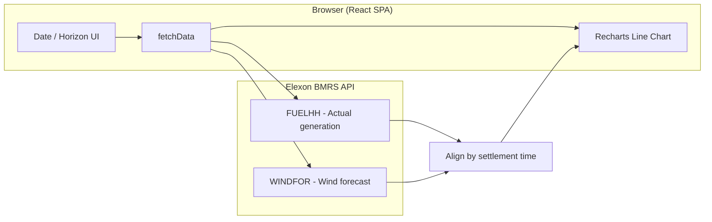

# 🌬️ UK Wind Power Forecast App

A web application to visualize **UK national wind power generation forecasts** versus **actual generation**, with configurable date ranges and forecast horizons. Built with React and powered by the Elexon BMRS API.

---

## 📍 Live App

**App link:** [https://wind-forecast-three.vercel.app](https://wind-forecast-three.vercel.app)

The project is hosted on Vercel. Use the link above to run the app without installing anything locally.

---

## 📋 Table of Contents

- [Overview](#overview)
- [Features](#features)
- [Project Structure](#project-structure)
- [Architecture](#architecture)
- [Tech Stack](#tech-stack)
- [Getting Started](#getting-started)
- [Analysis Summary](#analysis-summary)
- [Data Sources](#data-sources)
- [Credits](#credits)

---

## Overview

This app fetches **actual** half-hourly wind generation (FUELHH) and **forecast** data (WINDFOR) from the Elexon BMRS API, aligns them by settlement period, and displays a time-series comparison. You can:

- Choose a **start** and **end** date.
- Set a **forecast horizon** (0–48 hours) to filter forecasts by how far ahead they were published.
- View **Actual** vs **Forecast** (MW) in an interactive line chart.

The analysis notebook (`wind_analysis.ipynb`) summarizes forecast error metrics for January 2024.

---

## Features

- **Date range picker** — Inspect any period within available API data.
- **Forecast horizon slider** — Compare forecasts published at least N hours before the settlement period.
- **Interactive chart** — Line chart (Recharts) with tooltips and legend.
- **Responsive layout** — Usable on desktop and smaller screens.
- **Error handling** — User-friendly messages when fetches fail.

---

## Project Structure

```
wind-forecast-main/
├── public/
│   ├── index.html          # HTML shell, root div for React
│   ├── manifest.json       # PWA manifest
│   └── robots.txt          # Crawler directives
├── src/
│   ├── App.js              # Main app: state, API calls, chart UI
│   ├── App.css             # App-specific styles
│   ├── App.test.js         # Tests for App component
│   ├── index.js            # React entry: root render, StrictMode
│   ├── index.css           # Global styles
│   ├── logo.svg            # React logo asset
│   ├── reportWebVitals.js  # Optional performance reporting
│   └── setupTests.js       # Jest/testing setup
├── wind_analysis.ipynb     # Jupyter notebook: forecast error analysis (Jan 2024)
├── package.json            # Dependencies and scripts
└── README.md               # This file
```

| Path | Description |
|------|-------------|
| `src/App.js` | Single-page logic: date/horizon state, `fetchData()` (FUELHH + WINDFOR), alignment logic, Recharts line chart. |
| `src/index.js` | Renders `<App />` into `#root` with React 18 `createRoot`. |
| `public/index.html` | SPA template; script and meta tags for the React build. |
| `wind_analysis.ipynb` | Python/Pandas/Matplotlib analysis: MAE, bias, baseline recommendations. |

---

## Architecture

### High-level flow



### Data flow (simplified)

1. **User** sets start date, end date, and forecast horizon (hours), then clicks **Load Data**.
2. **App** requests:
   - **FUELHH** — actual half-hourly generation (filtered by `fuelType === 'WIND'`) for the chosen date range.
   - **WINDFOR** — wind forecast stream; `publishDateTimeFrom` is set to ~35 days before start date to capture forecasts that apply to the range.
3. **Alignment**:
   - Actuals are keyed by `startTime`.
   - Forecasts are filtered by horizon (target time − publish time ≥ horizon) and, per settlement period, the latest published forecast is kept.
   - Combined series is built by matching settlement times; missing forecasts appear as gaps in the chart.
4. **Chart** — Recharts `LineChart` with two lines: **Actual** (blue) and **Forecast** (green).

### Component / module roles

| Layer | Role |
|-------|------|
| **UI (App.js)** | Inputs (date, horizon), Load button, error message, ResponsiveContainer + LineChart. |
| **Data (App.js)** | `fetchData()`, `floorToHour()`, mapping FUELHH/WINDFOR into a single time-series array. |
| **Entry (index.js)** | Mounts `App` in `#root`; no routing or extra providers. |
| **External** | Elexon BMRS public API (HTTPS, no auth required for used endpoints). |

---

## Tech Stack

| Category | Technology |
|----------|------------|
| **Frontend** | React 19, Recharts |
| **Build / Dev** | Create React App (react-scripts) |
| **Data** | Elexon BMRS API (FUELHH, WINDFOR) |
| **Analysis** | Python, Jupyter, Pandas, Matplotlib |
| **Hosting** | Vercel |
| **Testing** | React Testing Library, Jest |

---

## Getting Started

### Prerequisites

- **Node.js** (v16+ recommended) and **npm**.

### Install and run

1. **Install dependencies**
   ```bash
   npm install
   ```

2. **Start the development server**
   ```bash
   npm start
   ```

3. **Open in browser**  
   Navigate to [http://localhost:3000](http://localhost:3000).

### Other scripts

| Command | Description |
|---------|-------------|
| `npm run build` | Production build (e.g. for Vercel). |
| `npm test` | Run tests (Jest + React Testing Library). |

---

## Analysis Summary

From the January 2024 analysis in `wind_analysis.ipynb`:

| Metric | Value |
|--------|--------|
| **Mean Absolute Error** | 2,085 MW |
| **Forecast bias** | +1,359 MW (over-forecasting) |
| **Recommended reliable wind baseline** | 5,000 MW (available ~90.5% of the time) |

---

## Data Sources

- **Elexon BMRS API**  
  - [FUELHH](https://data.elexon.co.uk/bmrs/api/v1/datasets/FUELHH) — actual half-hourly generation by fuel type.  
  - [WINDFOR](https://data.elexon.co.uk/bmrs/api/v1/datasets/WINDFOR) — wind generation forecast stream.  

Data is publicly available; no API key is required for the endpoints used by this app.

---

## Credits

- **Built with** — React, Recharts, Elexon BMRS API, Python/Jupyter for analysis.
- **Deployed at** — [https://wind-forecast-three.vercel.app](https://wind-forecast-three.vercel.app) (Vercel).
